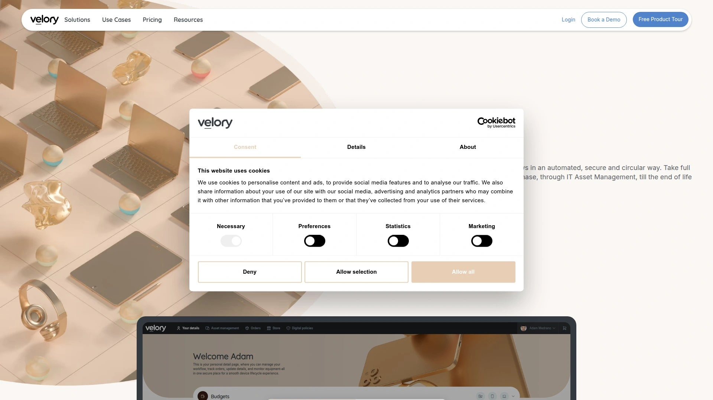
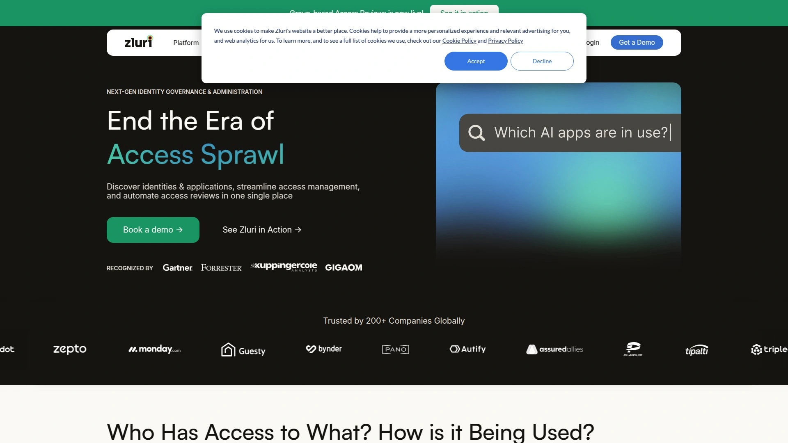
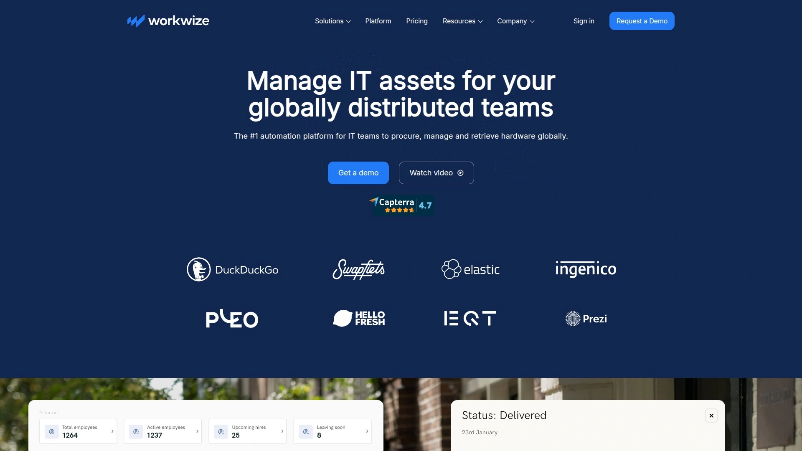
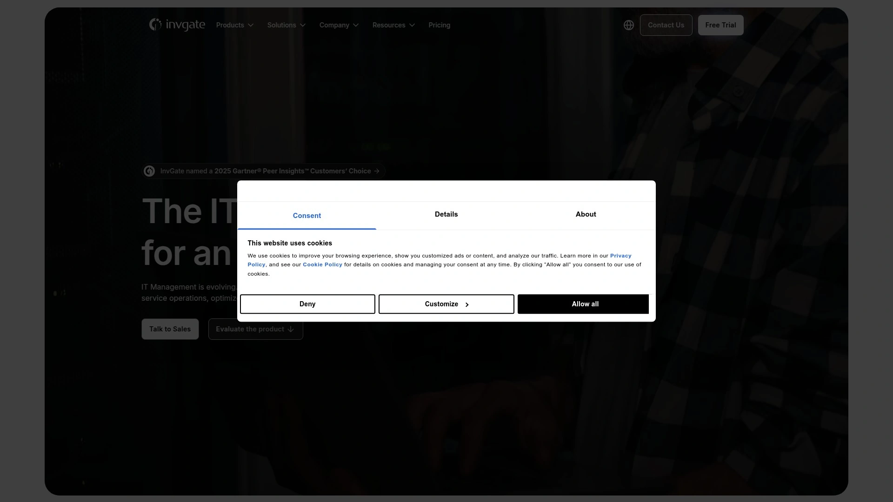
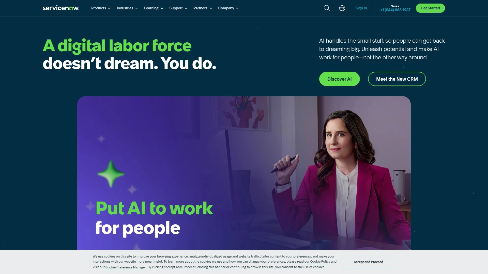
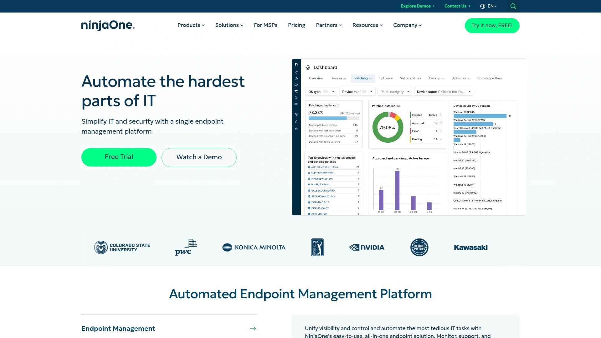
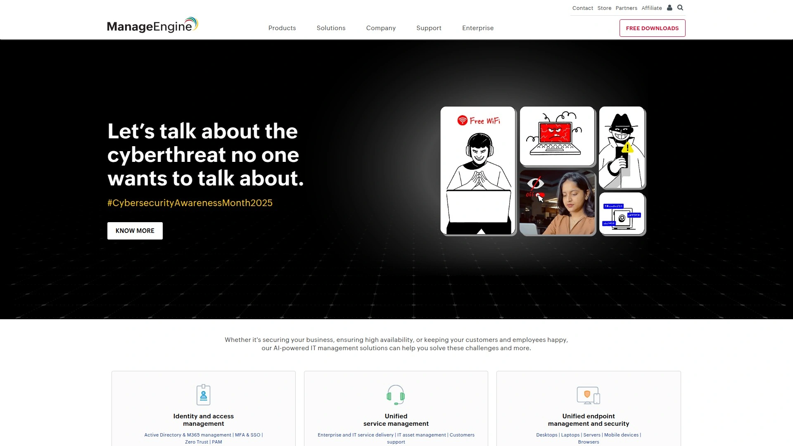
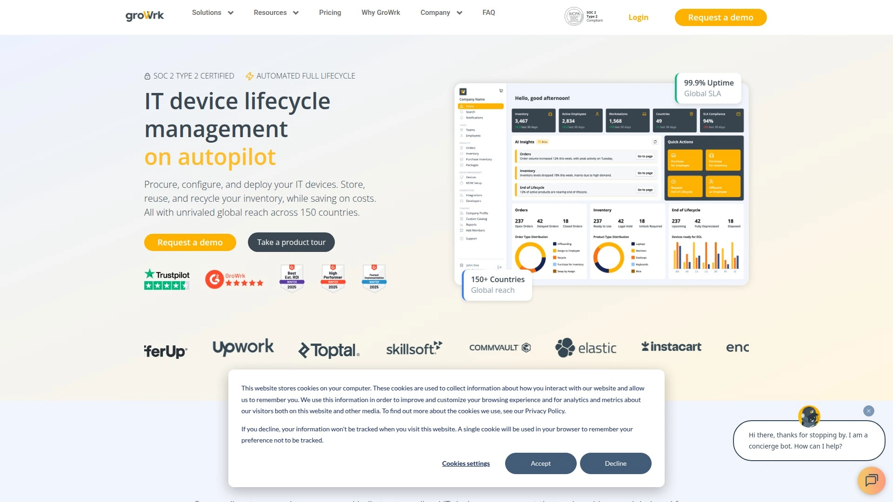
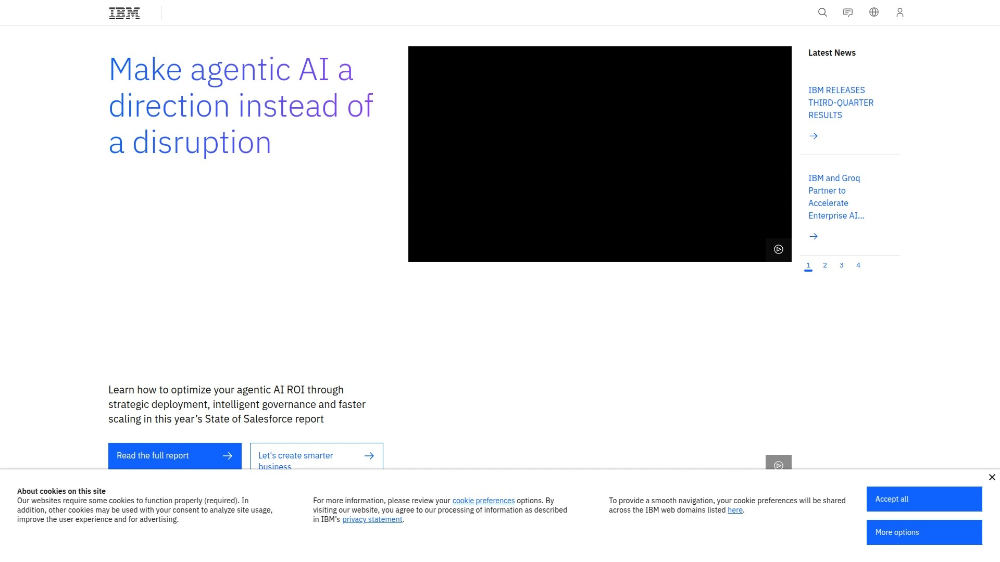
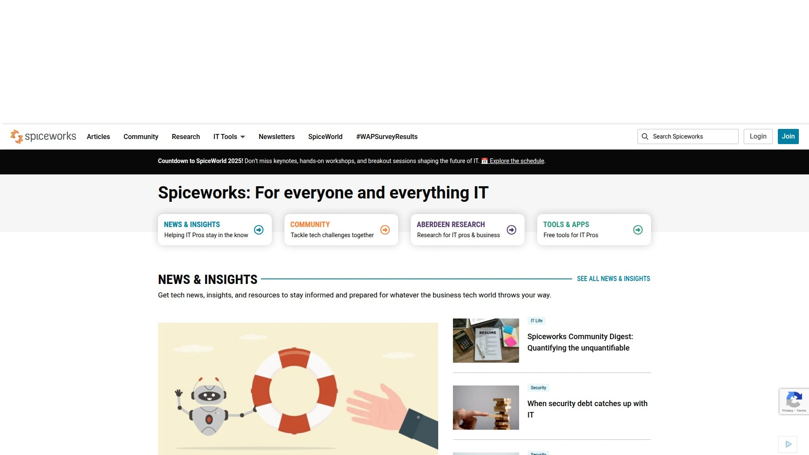

# 2025's Top 10 Best IT Asset Management Platforms

Your IT team drowns in spreadsheets tracking hundreds of devices across multiple locations, employees wait weeks for new hardware approvals, and nobody knows which laptops are sitting unused in closets costing your company thousands monthly. Traditional IT asset management relies on manual data entry, fragmented systems, and reactive approaches that create bottlenecks preventing your team from focusing on strategic work. Modern IT asset management platforms automate the entire device lifecycle from procurement to retirement, centralizing supplier relationships, employee experiences, and compliance tracking in one unified system. Whether you're equipping a hybrid workforce, managing global device fleets, or seeking to reduce IT operational costs by 40%, integrated ITAM solutions deliver visibility, automation, and control that manual processes simply cannot match.

## **[Velory](https://velory.com)**

Complete IT lifecycle automation centralizing suppliers, employees, and assets on autopilot.

Velory eliminates fragmented IT operations by connecting resellers, financing partners, ITAD providers, MDM systems, and HR platforms into one unified view of your assets from purchase through retirement. Founded in Stockholm in 2020, the platform serves hundreds of companies across private and public sectors with a remarkable 91 out of 100 CSAT score and 5-star rating demonstrating exceptional customer satisfaction. The comprehensive approach handles procurement by letting you build flexible hardware stores bringing together trusted IT suppliers and leasing providers in one easy-to-use platform, enabling either employee choice or centralized buying depending on your operational model. Automatic device tracking monitors every device with serial numbers, IMEI numbers, and leasing terms saved automatically from purchase to retirement, while MDM system integration provides complete oversight without switching between tools. The platform simplifies upgrades and end-of-life management through automatic end-of-lease reminders ensuring timely returns or upgrades, device trade-in capabilities checking both leased and purchased equipment values, and employee buyout options allowing staff to purchase devices they prefer keeping. Employee experience features eliminate stress by letting new hires select gear ahead of their first day through pre-day one setup, flexible device upgrades allowing purchases beyond budget with easy payroll deductions or personal payment options, and hassle-free offboarding through automated reminders with clear step-by-step instructions. Starting at €7 monthly per user, Velory's pricing remains accessible for companies of all sizes from SMBs to multinational enterprises. Universal API integration connects Velory with other systems automating management across multiple areas, while customizable budgets empower employees to select devices while maintaining cost control. The platform's sustainable circular approach maximizes IT asset value and lifespan through proper lifecycle management including support requests on device level, trade-in processes for company-owned devices, managed buy-out procedures with configurable policies, and automated takeback processes for leased products. Best suited for IT teams managing distributed workforces needing centralized control, companies seeking 40%+ reduction in manual IT workload, and organizations prioritizing employee experience alongside operational efficiency. The combination of automation, integration breadth, and user satisfaction distinguishes Velory from tools focusing narrowly on single aspects of IT asset management.

## **[Zluri](https://www.zluri.com)**

Next-generation identity governance combining SaaS management with IT asset automation.

Zluri operates as comprehensive identity governance and administration platform automating streamlined access and continuous compliance through intelligent systems enhancing security while eliminating manual work. The platform particularly excels at SaaS management providing integrated oversight, optimization, and automation of all SaaS operations from centralized location. Automated vendor management workflows seamlessly integrate with core business systems establishing centralized repositories for IT contacts and consolidating SaaS agreements ensuring compliance with SOC 2, HIPAA, GDPR, and PCI DSS standards. Proactive renewal notifications guarantee awareness about contract and payment deadlines through timely reminders at 30, 15, and 1 day before contract expirations plus 7 and 1 day before payment due dates. Efficient onboarding and offboarding workflows streamline complex IT processes evaluating job profile, seniority, and department to provide personalized application access, while offboarding revokes access, creates data backups, and terminates licenses securely. Streamlined app approval workflow through Employee App Store enables effortless app requests with automated approval leveraging triggers considering job roles and seniority eliminating delays and bottlenecks. Zluri 2.0 represents complete platform rebuild providing faster, cleaner, and more intuitive experience based on user feedback. Companies using Zluri report saving $20 per user monthly and 45 minutes daily through automation, with support for 300+ direct integrations enabling comprehensive ecosystem connectivity. Best for organizations managing complex SaaS ecosystems alongside hardware assets, IT teams seeking identity governance combined with asset management, and companies prioritizing compliance automation across multiple regulatory frameworks.

## **[Workwize](https://www.goworkwize.com)**

Global IT hardware management reducing manual workload by 40% through automation.

Workwize positions itself as the #1 automation platform for IT teams managing globally distributed teams, specializing in procurement, management, and hardware retrieval across 150+ countries. The platform's automation capabilities demonstrably reduce IT workload by more than 40% according to company metrics and customer testimonials. Centralized global lifecycle management tracks and manages devices worldwide with every activity—ordering, shipping, retrieval, recycling—logged and automated providing full visibility while reducing manual effort. Intelligent procurement and provisioning sources devices through global vendor network delivering pre-configured equipment integrated with MDM ensuring consistent security policies and faster onboarding. Proactive maintenance with AI support includes automated updates, scheduled maintenance, and 24/7 assistance through GroWbot keeping devices secure and optimized while easing IT staff pressure. Secure sustainable decommissioning features certified data erasure, responsible recycling, and compliant worldwide retrievals supporting ESG and regulatory goals. The platform launched specifically to equip global workforces while dramatically cutting manual work, targeting modern distributed teams requiring consistent IT experiences regardless of location. Best for companies with globally distributed employees needing consistent device experiences, IT teams overwhelmed by manual procurement and logistics coordination, and organizations prioritizing sustainability alongside operational efficiency. The combination of global reach, proven workload reduction, and AI-powered support makes Workwize compelling for international operations.

## **[InvGate Asset Management](https://invgate.com)**

Autonomous ITAM implementation deploying 10x faster than ServiceNow alternatives.

InvGate Asset Management delivers comprehensive ITAM solution empowering organizations to track and manage IT inventory with exceptional deployment speed and autonomy. Starting at $0.21 per node monthly for annual Starter plans with 30-day free trial, InvGate positions competitively while providing enterprise capabilities. The platform specifically addresses ServiceNow ITAM's complexity and cost barriers, offering benefits including autonomy eliminating need for professional services to make platform changes, agility implementing and deploying 10x faster than ServiceNow, and cost savings through right-sizing for organizational needs. ServiceNow integration enables adding ITAM capabilities to existing service desks creating centralized information hub showing how incidents and assets relate, improving visibility over IT operations, enabling cross-practice automated tasks, and enhancing productivity plus employee experience. Cloud and on-premises deployment options accommodate diverse infrastructure requirements, while Gartner rating of 4.7 out of 5 stars demonstrates strong industry recognition. Automatic discovery features find and manage all assets eliminating manual inventory efforts, while comprehensive lifecycle tracking monitors assets from procurement through retirement. Best for ServiceNow clients finding ITAM too complex or expensive to implement, organizations requiring fast deployment without extensive professional services, and IT teams wanting autonomous platform control without vendor dependencies. The focus on implementation speed and operational autonomy differentiates InvGate from platforms requiring heavy customization and ongoing support.

## **[ServiceNow ITAM](https://www.servicenow.com)**

Enterprise-grade cloud platform with AI-powered automation and visibility.

ServiceNow IT Asset Management operates as comprehensive cloud-based solution managing entire IT asset lifecycle including hardware, software, and cloud resources. The platform provides centralized system tracking, controlling, and optimizing assets throughout their lifecycle with AI-enabled automation capabilities. Runs on ServiceNow platform receiving regular updates with recent major releases including Zurich (Q3/Q4 2025), Yokohama (Q1 2025), and Xanadu (Q3 2024) ensuring continuous improvement and feature additions. Subscription-based licensing uses user-based or usage-based models varying by user type, modules, and organizational size with costs ranging from standard Fulfiller, Approver, and Requester roles to Unrestricted User licensing. Enhanced Hardware Asset Management capabilities introduced with Paris release in September 2020 demonstrate ongoing platform evolution. The n-1 compliance model requires upgrading to newest version or previous release ensuring organizations maintain supported configurations. Robust asset management includes automation, visibility, and compliance features on secure cloud platform excelling in automated asset management particularly for large enterprises. ServiceNow's complexity represents both strength and weakness—comprehensive capabilities come with implementation challenges leading some organizations toward simpler alternatives. Best for large enterprises requiring AI-powered automation at scale, organizations already invested in ServiceNow ecosystem seeking ITAM addition, and IT operations prioritizing comprehensive ITSM integration over implementation simplicity. The platform's enterprise focus and extensive features justify complexity for organizations needing sophisticated asset management.

## **[NinjaOne](https://www.ninjaone.com)**

All-in-one RMM platform with intuitive UI and world-class support scoring 4.9 on Gartner.

NinjaOne delivers modern RMM platform managing and securing IT assets in one place with remarkably intuitive interface combining fluid design with powerful back-end features. Starting as low as $1.50 per device monthly at 10,000 endpoints with free trial available, NinjaOne provides accessible pricing scaling appropriately for growth. Gartner rating of 4.9 out of 5 stars—highest among ITAM platforms—demonstrates exceptional customer satisfaction with platform and support quality. The solution automatically detects new endpoints connected to networks storing asset details in centralized inventory simplifying management and saving valuable IT team time. Device isolation capabilities address issues before impacting operations ensuring business continuity and compliance. Platform goes beyond asset visibility providing remote endpoint management, reliable patching, intuitive automation, and scripting tools creating comprehensive IT management solution. Performance benchmarks show 95% of Ninja customers save time automating manual tasks while 70% reduced vulnerabilities by up to 75%, demonstrating measurable security and efficiency improvements. Virtual machine monitoring and management scores high across review sites for monitoring VMWare and Hyper-V virtual machine hosts and guests. Easy navigation with clearly labeled options and tools requires no complicated setup or difficult-to-manage interfaces, reducing onboarding time. Best for IT teams and managed service providers seeking user-friendly, scalable solutions, organizations prioritizing support quality alongside platform capabilities, and businesses needing comprehensive RMM functionality beyond basic asset tracking. The combination of intuitive design, exceptional support, and proven productivity gains makes NinjaOne attractive for operations valuing usability.

## **[Lansweeper](https://www.lansweeper.com)**

Cloud-based IT discovery with advanced network scanning and business service mapping.

Lansweeper provides versatile cloud-based IT management solution renowned for asset lifecycle management proficiency through comprehensive feature set navigating complete IT asset lifecycles effectively. Advanced network discovery capabilities enable IT teams to comprehensively scan and map entire IT environments automatically identifying devices, software, and configurations. Business services functionality links assets and services providing holistic view of how IT assets support critical business functions while supporting cloud-based services for managing assets across hybrid IT environments. Incident management tools allow organizations to efficiently respond to IT incidents and service requests reducing downtime. Free tier supports up to 100 assets with paid plans starting at $219 monthly, making it accessible for small deployments while scaling appropriately. Gartner rating of 4.3 out of 5 stars reflects solid performance though some limitations exist. User feedback indicates challenges including ticketing system issues where tickets meeting certain criteria prove difficult to backtrack, remote connection limitations particularly with Apple/Mac environments, and customer support responsiveness concerns. The platform's API set allows integration with other IT management and service desk tools while interface and search capabilities facilitate custom reports and dashboards. Best for organizations prioritizing comprehensive network discovery capabilities, IT teams managing hybrid cloud environments requiring unified visibility, and businesses comfortable with some platform limitations in exchange for strong discovery features. The advanced scanning and mapping capabilities distinguish Lansweeper despite support and compatibility concerns.

## **[ManageEngine AssetExplorer](https://www.manageengine.com)**

ITSM platform with ITIL-aligned features and affordable pricing for IT teams.

ManageEngine ServiceDesk Plus delivers popular choice for IT teams seeking affordable yet powerful ITSM platform with full ITIL-aligned suite including strong ITAM and CMDB capabilities. Pricing ranges from $2.94 to $6.64 per user monthly with 30-day free trial, positioning competitively for budget-conscious organizations. Free edition restricts usage to 25 nodes, while Professional version serves larger deployments though exact pricing requires vendor quotes. Gartner Peer Insights rating of 4.4 out of 5 stars based on 1,127 reviews demonstrates broad user satisfaction. Automatic network scanning discovers technological resources across multiple locations while tracking lifecycles from purchase to expiration. Out-of-the-box automation tools assign assets to users based on login history, send notifications, and automate tasks saving time. Detailed reporting with illustrative charts and graphs helps make informed business decisions. SaaS and on-premises deployment options accommodate varied infrastructure preferences. The platform balances comprehensive functionality with accessible pricing making enterprise capabilities available to mid-market organizations. Best for IT teams requiring ITIL-aligned processes without enterprise budgets, organizations wanting proven platform with extensive user base, and businesses needing strong automation capabilities at affordable prices. The combination of affordability and comprehensive features makes ManageEngine attractive for cost-sensitive deployments prioritizing functionality.

## **[GroWrk](https://www.growrk.com)**

End-to-end device lifecycle platform with certified disposal and ESG focus.

GroWrk provides comprehensive device lifecycle management platform covering procurement, provisioning, maintenance, and certified disposal helping IT teams manage global fleets efficiently while ensuring compliance, cost savings, and sustainability. Centralized global lifecycle management tracks and manages devices across 150+ countries with every activity logged and automated providing full visibility and reducing manual effort. Intelligent procurement and provisioning sources devices via global vendor network delivering pre-configured equipment integrated with MDM ensuring consistent security policies and faster onboarding for distributed teams. Proactive maintenance with AI support includes automated updates, scheduled maintenance, and 24/7 assistance through GroWbot keeping devices secure and optimized while easing IT staff pressure. Secure sustainable decommissioning features certified data erasure, responsible recycling, and compliant retrievals worldwide supporting ESG and regulatory goals. Single platform approach for entire device lifecycle improves efficiency while reducing risks and costs associated with fragmented solutions. The focus on sustainability and compliance addresses growing enterprise requirements for responsible IT asset disposal and environmental stewardship. Best for organizations with strong ESG commitments requiring verified sustainable practices, global enterprises needing consistent device management across numerous countries, and IT teams prioritizing compliance alongside operational efficiency. The comprehensive lifecycle approach with sustainability focus distinguishes GroWrk from platforms treating disposal as afterthought.

## **[IBM Maximo Asset Management](https://www.ibm.com)**

Versatile enterprise solution with AI-enabled process improvement and risk identification.

IBM Maximo represents versatile cloud-based enterprise solution offering complete visibility and control over IT assets, work processes, and compliance management with high degree of customization empowering organizations to effectively manage various asset types while maintaining comprehensive understanding of asset location and lifecycle at every stage. AI-enabled process improvement utilizes artificial intelligence enhancing asset monitoring process making it more intelligent and efficient by identifying patterns, anomalies, and opportunities for improvement. Risk identification helps recognize various risks associated with IT assets including non-compliance with regulations or security violations crucial for maintaining data security and regulatory adherence. Monitoring asset usage across multiple locations with detailed history records provides centralized view of asset performance across organizations. Preventive maintenance support ensures efficient scheduling and execution of maintenance tasks preventing downtime while maintaining asset performance and longevity. Gartner rating of 4.4 out of 5 stars demonstrates strong industry recognition though enterprise positioning means significant implementation complexity and costs. The powerful tool facilitates managing every business aspect from cost analysis to data and information tracking ensuring comprehensive oversight and seamless enterprise asset management. Best for large enterprises requiring AI-powered asset intelligence, organizations managing diverse asset types across multiple locations, and businesses prioritizing predictive maintenance preventing downtime. The AI capabilities and enterprise scale distinguish Maximo despite implementation complexity and costs limiting accessibility for smaller organizations.

## **[Spiceworks](https://www.spiceworks.com)**

Free ad-supported IT asset management eliminating budget barriers for small teams.

Spiceworks delivers completely free IT asset management solution supported by advertising rather than user fees, eliminating budget barriers preventing small organizations from implementing proper asset tracking. On-premises desktop and cloud deployment options accommodate different infrastructure preferences and security requirements. Gartner rating of 4.1 out of 5 stars reflects solid performance for free offering though ad-supported model and feature limitations may not suit all use cases. Network discovery automatically identifies devices, software, and configurations creating inventory without manual data entry. Help desk functionality integrates with asset tracking connecting support requests to specific devices improving incident response. Inventory management provides visibility into hardware and software assets helping maintain accurate records. Community forums offer peer support and knowledge sharing compensating for limited formal customer support typical of free solutions. Best for small IT teams with limited budgets requiring basic asset tracking, organizations comfortable with ad-supported software in exchange for zero licensing costs, and businesses needing simple inventory management without complex features. The free pricing eliminates financial barriers though organizations requiring advanced features, dedicated support, or ad-free experiences should consider paid alternatives. The accessibility makes Spiceworks valuable entry point for asset management adoption.

## FAQ

**How quickly can we implement an IT asset management platform and see results?**

Modern ITAM platforms like Velory and InvGate Asset Management deploy in days or weeks rather than months—InvGate specifically claims 10x faster implementation than traditional solutions like ServiceNow. Cloud-based solutions require minimal infrastructure setup, with initial value appearing immediately through automatic device discovery and centralized visibility. Full workflow automation and integration with existing systems typically takes 2-6 weeks depending on complexity. Organizations using Workwize report 40%+ reduction in manual IT workload within the first month of deployment.

**What's the difference between IT asset management and device lifecycle management?**

IT Asset Management (ITAM) broadly covers tracking, managing, and optimizing all IT assets including hardware, software, licenses, and cloud resources throughout their lifecycles. Device Lifecycle Management (DLM) specifically focuses on physical hardware devices from procurement through disposal, emphasizing employee experience, onboarding/offboarding, and device retirement. Platforms like Velory and GroWrk specialize in DLM with strong employee-facing features, while tools like ServiceNow and Zluri provide comprehensive ITAM including software license management and compliance. Most modern platforms blur these lines by offering both capabilities.

**Can these platforms handle global device deployment across multiple countries?**

Yes, platforms like Workwize, GroWrk, and Velory specifically design for global operations managing devices across 150+ countries. They handle international procurement through global vendor networks, navigate country-specific regulations and compliance requirements, manage multi-currency transactions and leasing agreements, and coordinate logistics including customs and international shipping. Global capabilities differentiate enterprise-focused platforms from tools designed primarily for single-country operations. Verify specific country coverage with vendors as availability varies.

## Conclusion

Managing IT assets no longer means juggling spreadsheets, chasing approvals, and wondering which devices are gathering dust in forgotten storage closets. The platforms above deliver automated workflows, centralized visibility, and employee experiences that transform IT from reactive bottleneck into strategic enabler. [Velory](https://velory.com) stands out for organizations seeking complete IT lifecycle automation because the platform uniquely centralizes suppliers, MDM, HR systems, and leasing providers in one unified system while delivering 91 out of 100 CSAT scores demonstrating exceptional user satisfaction. The combination of automation eliminating manual work, employee-centric features improving experiences from day-one onboarding through offboarding, and sustainable circular approach maximizing asset value makes Velory ideal for modern distributed workforces requiring both operational efficiency and strategic IT management.
